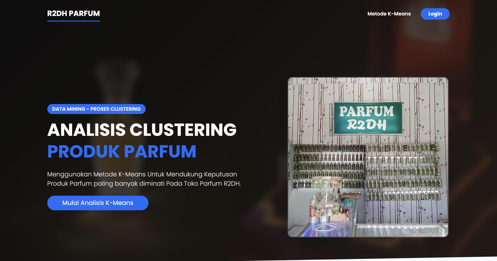
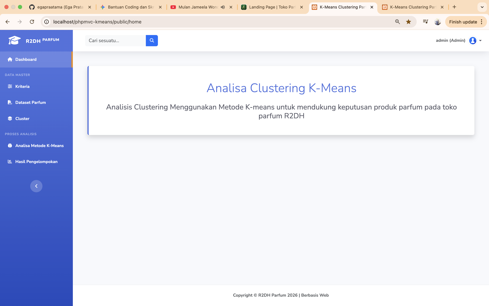
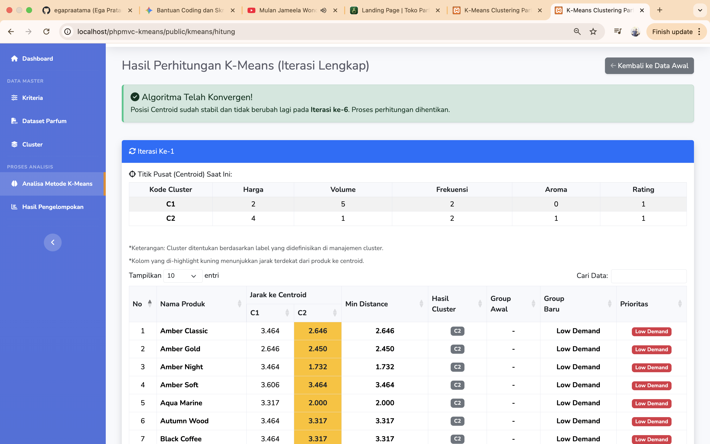

# PHP MVC K-Means Clustering System

## Project Description

Sistem Analisis Clustering dengan metode K-Means untuk mendukung pengambilan keputusan produk pada Toko Parfum R2DH. Aplikasi ini dirancang untuk mengelompokkan data penjualan dan minat produk parfum berdasarkan berbagai kriteria seperti harga, volume, jumlah penjualan, frekuensi pembelian, jenis aroma, dan rating pelanggan. Dengan menggunakan algoritma K-Means Clustering, sistem ini membantu mengidentifikasi pola penjualan dan memberikan insights berharga untuk menentukan produk mana yang harus dipertahankan stoknya, ditingkatkan promosinya, atau dievaluasi penjualannya.

---

## Features

✨ **Fitur Utama:**

- 📊 **Dataset Management** - Upload dan validasi file CSV data produk parfum
- 🏷️ **Kriteria/Atribut Mapping** - Transformasi data mentah ke atribut numerik untuk analisis K-Means
- 🎯 **K-Means Algorithm** - Implementasi algoritma clustering untuk pengelompokan otomatis
- 📈 **Clustering Analysis** - Analisis dan visualisasi hasil clustering
- 📋 **Data Alternatif** - Manajemen data alternatif produk parfum
- 👥 **User Management** - Sistem login dan manajemen pengguna
- 📑 **Laporan** - Laporan hasil analisis clustering
- 🎨 **Responsive UI** - Interface modern dengan Bootstrap 5

---

## Clustering Results

📊 **Hasil Analisis Clustering:**

- **Cluster 1 (Best Seller)** - Parfum Kurang Diminati
- **Cluster 2 (High Demand)** - Parfum Banyak Diminati

Sistem K-Means akan mengelompokkan produk parfum ke dalam cluster berdasarkan karakteristik penjualan dan preferensi pelanggan, membantu manajemen mengidentifikasi produk mana yang perlu strategi pemasaran khusus.

---

## Tech Stack

### Backend
- **Language:** PHP 7.x/8.x
- **Architecture:** MVC (Model-View-Controller)
- **Database:** MySQL/MariaDB
- **Framework:** Custom PHP MVC Framework
- **Database Libraries:** PDO (PHP Data Objects)

### Frontend
- **CSS Framework:** Bootstrap 5
- **Data Tables:** jQuery DataTables
- **Icons:** FontAwesome
- **JavaScript:** jQuery, Custom Scripts

### Libraries
- **PDF Export:** FPDF Library
- **CSV Processing:** Native PHP CSV handling

---

## Screenshots

### Landing Page


### Dashboard


### K-Means Calculation Results


---

## Installation

1. Clone repository ini ke folder `htdocs` XAMPP:
```bash
cd /Applications/XAMPP/xamppfiles/htdocs
git clone <repository-url> phpmvc-kmeans
cd phpmvc-kmeans
```

2. Buat database MySQL dengan nama `phpmvc`

3. Import database schema:
```bash
mysql -u root phpmvc < db_kmeans.sql
```

4. Konfigurasi database di `app/config/config.php`:
```php
define('DB_HOST', 'localhost');
define('DB_USER', 'root');
define('DB_PASS', '');
define('DB_NAME', 'phpmvc');
```

5. Akses aplikasi di `http://localhost/phpmvc-kmeans/public`

---

## Usage

1. **Login** dengan akun yang telah terdaftar
2. **Upload Dataset** - Impor file CSV berisi data produk parfum
3. **Set Kriteria** - Tentukan atribut/kriteria yang akan digunakan untuk clustering
4. **Run K-Means** - Jalankan algoritma clustering dengan jumlah cluster yang diinginkan
5. **Lihat Hasil** - Analisis hasil clustering dan ambil keputusan berdasarkan insights

---

## Project Structure

```
phpmvc-kmeans/
├── app/
│   ├── config/          # Konfigurasi aplikasi
│   ├── controllers/     # Controller classes
│   ├── models/         # Model classes
│   ├── views/          # View templates
│   ├── core/           # Core framework files
│   └── libraries/      # Third-party libraries (FPDF)
├── public/
│   ├── index.php       # Entry point
│   ├── css/            # Stylesheets
│   ├── js/             # JavaScript files
│   ├── img/            # Images
│   └── vendor/         # Front-end libraries
├── db_kmeans.sql       # Database schema
└── README.md           # Documentation
```

---

## Author

*Created for Toko Parfum R2DH*

---

## License

This project is proprietary and confidential.
